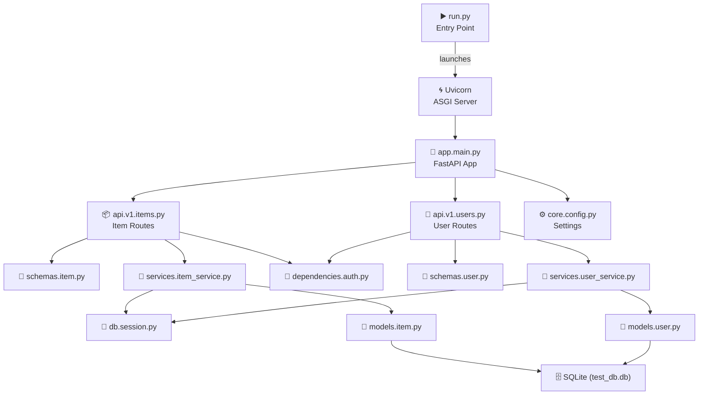
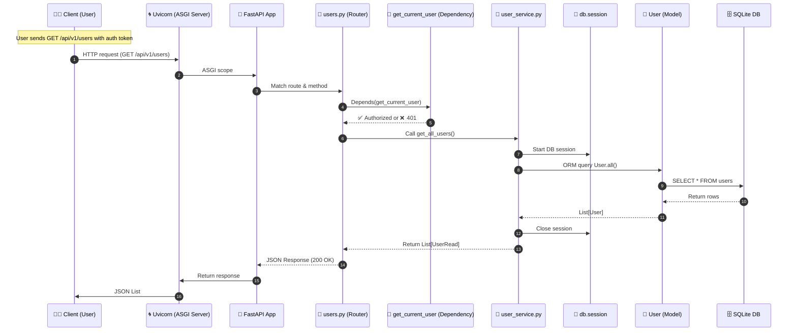

# 🚀 FastAPI Template Project

A production-ready, modular FastAPI backend template with:

- Clean project architecture (versioned API, services, models, schemas, etc.)
- Pydantic v2 compatibility
- SQLAlchemy 2.x support with SQLite
- Dependency injection & basic auth simulation
- Pytest test suite with 100% passing tests
- Future-ready: Docker, OAuth2, Alembic, deployment support

The design was adhered as much as possible to [Best Practices](https://github.com/berserkhmdvhb/API_Python_Test/tree/main/BestPractices).

---

## 🗂️ Project Structure

```
fastapi-template-dev/
├── src/
│   ├── app/
│   │   ├── api/              ← Route handlers (v1)
│   │   ├── core/             ← App config, settings
│   │   ├── db/               ← Database connection/session
│   │   ├── dependencies/     ← Dependency injections (e.g., auth)
│   │   ├── models/           ← SQLAlchemy models
│   │   ├── schemas/          ← Pydantic models
│   │   ├── services/         ← Business logic layer
│   │   └── main.py           ← FastAPI app instance
│   └── scripts/
│       └── initialize_db.py  ← Creates tables
├── tests/                    ← Unit test files
│   ├── test_items.py
    ├── test_users.py
│   └── test_main.py
├── .env.example              ← Environment config sample
├── requirements.txt          ← Dependencies
├── pytest.ini                ← Pytest config (for path resolution)
└── README.md
```

---
## 📊 Diagram

### Overview


### Request Flow


---
## 🧪 Tests

Run all tests:

```bash
pytest
```

All tests currently pass. Test files cover:
- Auth behavior
- CRUD endpoints
- Error cases (missing tokens, invalid routes)

---

## ⚙️ Setup & Run Locally

### 1. Clone & Setup

```bash
git clone https://github.com/yourusername/fastapi-template-dev.git
cd fastapi-template-dev
python -m venv env
env\Scripts\activate  # or source env/bin/activate on Unix
pip install -r requirements.txt
```

### 2. Set Environment Variables

Copy `.env.example` and name it `.env`

```bash
cp .env.example .env
```

### 3. Initialize the Database

```bash
python src/scripts/initialize_db.py
```

### 4. Run the Server
In terminal, run following: 

```bash
uvicorn app.main:app --reload --app-dir src
```

You can also simply run following command instead, from the root directory of project:

```bash
python .\src\run.py
```

Open browser:
- API: http://localhost:8000
- Docs: http://localhost:8000/docs

To run the CRUD methods in the server, you need to insert the following token:
`fake-super-secret-token`

### Demo
```bash
curl -X GET http://localhost:8000/api/v1/users \
  -H "token: fake-super-secret-token"
```

---

## 🔐 Simulated Authentication

Add this header to your requests to access protected routes:

```
token: fake-super-secret-token
```
### Item Endpoint Access Summary

| Endpoint             | Method | Auth Required | Description                     |
|----------------------|--------|---------------|---------------------------------|
| `/items/`            | POST   | ✅ Yes        | Create a new item               |
| `/items/`            | GET    | ✅ Yes        | List all items                  |
| `/items/{item_id}`   | GET    | ✅ Yes        | Retrieve a single item by ID    |

### User Endpoint Access Summary

| Endpoint             | Method | Auth Required | Description                          |
|----------------------|--------|---------------|--------------------------------------|
| `/users/`            | POST   | ❌ No         | Create a new user                    |
| `/users/`            | GET    | ✅ Yes        | List all users                       |
| `/users/{user_id}`   | GET    | ✅ Yes        | Retrieve a user with their items     |

---

## 🧱 Tech Stack

- [FastAPI](https://fastapi.tiangolo.com/)
- [Pydantic v2](https://docs.pydantic.dev/)
- [SQLAlchemy 2](https://docs.sqlalchemy.org/en/20/)
- [Pytest](https://docs.pytest.org/)
- [Uvicorn](https://www.uvicorn.org/)
- SQLite (for local/dev)

---

## 📦 Roadmap / To-Do

| Task                                | Purpose                         |
|-------------------------------------|---------------------------------|
| 🔐 Add OAuth2 + JWT auth            | Secure real users               |
| 🛢 Add Alembic migrations           | Safer schema evolution          |
| 🐳 Add Dockerfile + docker-compose  | Simplified deployment           |
| ☁️ Deploy to Render / Azure / Railway | Live demo hosting              |

---
