# FastAPI Template Project

A production-ready, modular FastAPI backend template with:

- Modular and scalable architecture (versioned API, services, models, schemas, etc.)
- Pydantic v2 compatibility
- SQLAlchemy 2.x support with SQLite
- Dependency injection & basic auth simulation
- Pytest test suite for unit tests
- Future-ready: Docker, OAuth2, Alembic, deployment support

The design was adhered as much as possible to [Best Practices](https://github.com/berserkhmdvhb/API_Python_Test/tree/main/BestPractices).

---

## 🗂️ Project Structure

```
fastapi-template-dev/
├── src/
│   ├── app/
│   │   ├── api/              ← Route handlers (versioned, e.g., v1)
│   │   ├── core/             ← App config and environment settings
│   │   ├── db/               ← Database connection/session management (SQLite)
│   │   ├── dependencies/     ← Dependency injections (e.g., auth)
│   │   ├── models/           ← SQLAlchemy ORM models
│   │   ├── schemas/          ← Pydantic request/response models
│   │   ├── services/         ← Business logic and DB operations
│   │   └── main.py           ← FastAPI app instantiation
│   └── scripts/
│       ├── initialize_db.py  ← Initializes DB schema
│       └── reset_db.py       ← Clears tables (for testing/dev)
├── tests/                    ← Unit tests
│   ├── test_items.py         ← Tests for /items endpoints
│   ├── test_users.py         ← Tests for /users endpoints
│   └── test_main.py          ← Base app and docs tests
├── .env.example              ← Sample environment variables
├── requirements.txt          ← Python dependencies
├── pytest.ini                ← Pytest config (e.g., path resolution)
└── README.md                 ← Project documentation
```

---
## 📊 Diagram

### Overview

```mermaid
graph TD
    %% Entry
    Run["▶️ run.py"] --> Uvicorn["🌀 Uvicorn (ASGI Server)"]
    Uvicorn --> App["🚀 app.main.py"]

    %% App Layer
    App --> Config["⚙️ core.config.py"]
    App --> UsersRouter["👤 users.py"]
    App --> ItemsRouter["📦 items.py"]

    %% Routers
    subgraph UsersRouterBlock["User Router Block"]
        UsersRouter --> UserSchemas["🧾 schemas.user.py"]
        UsersRouter --> UserService["🧠 user_service.py"]
        UsersRouter --> Auth1["🔐 auth.py"]
    end

    subgraph ItemsRouterBlock["Item Router Block"]
        ItemsRouter --> ItemSchemas["🧾 schemas.item.py"]
        ItemsRouter --> ItemService["🧠 item_service.py"]
        ItemsRouter --> Auth2["🔐 auth.py"]
    end

    %% Auth
    Auth1 --> UserService
    Auth2 --> UserService

    %% Services & DB
    UserService --> DBSession1["🔗 db.session"]
    ItemService --> DBSession2["🔗 db.session"]

    UserService --> UserModel["👤 models.user.py"]
    ItemService --> ItemModel["🧱 models.item.py"]

    UserModel --> SQLite["🗄️ SQLite DB"]
    ItemModel --> SQLite

    %% Abstract Logic
    UserService --> UserLogic["📋 User Ops"]
    ItemService --> ItemLogic["📋 Item Ops"]
```


### Request Flow

```mermaid
sequenceDiagram
    autonumber
    participant Client as 🧑‍💻 Client (User)
    participant Uvicorn as 🌀 Uvicorn (ASGI Server)
    participant FastAPI as 🚀 FastAPI App
    participant Router as 🔁 users.py / items.py (Router)
    participant Auth as 🔐 get_current_user (Dependency)
    participant UserService as 🧠 user_service.py
    participant ItemService as 🧠 item_service.py
    participant Session as 🔗 db.session
    participant Model as 🧱 User / Item Model
    participant DB as 🗄️ SQLite DB

    Note over Client: User sends GET /api/v1/items with auth token

    Client->>Uvicorn: HTTP request (GET /api/v1/items)
    Uvicorn->>FastAPI: ASGI scope

    FastAPI->>Router: Match route & method
    Router->>Auth: Depends(get_current_user)
    Auth-->>Router: ✅ Authorized or ❌ 401

    Router->>ItemService: Call Item Operations (CRUD)
    ItemService->>Session: Start DB session
    ItemService->>Model: ORM query Item.all() (or other operations)
    Model->>DB: Execute query (SELECT * FROM items)
    DB-->>Model: Return rows
    Model-->>ItemService: Return list of items

    ItemService->>Session: Close session
    ItemService-->>Router: Return List[ItemRead] or appropriate result

    Router-->>FastAPI: JSON Response (200 OK)
    FastAPI->>Uvicorn: Return response
    Uvicorn->>Client: JSON List or Data
```


---
## 🧪 Tests

Run all tests:

```bash
pytest
```

All tests currently pass. Test files cover:
- Auth behavior
- CRUD endpoints
- Error cases (missing tokens, invalid routes)

To test endpoints manually, you can run the codes in [testing](docs/testing/README.md) page.

---

## ⚙️ Setup & Run Locally

### 1. Clone & Setup

```bash
git clone https://github.com/yourusername/fastapi-template-dev.git
cd fastapi-template-dev
python -m venv env
env\Scripts\activate  # or source env/bin/activate on Unix
pip install -r requirements.txt
```

### 2. Set Environment Variables

Copy `.env.example` and name it `.env`

```bash
cp .env.example .env
```

### 3. Initialize the Database

The following code creates the database schema with default tables:

```bash
python src/scripts/initialize_db.py
```

If you need to clean the database (e.g., during testing) and truncate the tables, you can run the following script to clear the tables:

```bash
python src/scripts/reset_db.py
```

### 4. Run the Server
In terminal, run following: 

```bash
uvicorn app.main:app --reload --app-dir src
```

You can also simply run following command instead, from the root directory of project:

```bash
python .\src\run.py
```

Open browser:
- API: http://localhost:8000
- Docs:
    - Swagger UI: http://localhost:8000/docs
    - ReDoc: http://localhost:8000/redoc

To run the CRUD methods in the server, you need to insert the following token:
`fake-super-secret-token`

### Demo
```bash
curl -X GET http://localhost:8000/api/v1/users \
  -H "token: fake-super-secret-token"
```

---

## 🔐 Simulated Authentication

Add this header to your requests to access protected routes:

```
token: fake-super-secret-token
```

This token is checked by the `get_current_user` dependency to simulate authentication in the development environment. If the token is missing or incorrect, you will receive a 401 Unauthorized error. This is used for testing protected routes like the `POST /items/` and `GET /users/` endpoints.


### Item Endpoint Access Summary

| Endpoint             | Method | Auth Required | Description                     |
|----------------------|--------|---------------|---------------------------------|
| `/items/`            | POST   | ✅ Yes        | Create a new item               |
| `/items/`            | GET    | ✅ Yes        | List all items                  |
| `/items/{item_id}`   | GET    | ✅ Yes        | Retrieve a single item by ID    |

### User Endpoint Access Summary

| Endpoint             | Method | Auth Required | Description                          |
|----------------------|--------|---------------|--------------------------------------|
| `/users/`            | POST   | ❌ No         | Create a new user                    |
| `/users/`            | GET    | ✅ Yes        | List all users                       |
| `/users/{user_id}`   | GET    | ✅ Yes        | Retrieve a user with their items     |

---

## 🧱 Tech Stack

- [FastAPI](https://fastapi.tiangolo.com/)
- [Pydantic v2](https://docs.pydantic.dev/)
- [SQLAlchemy 2](https://docs.sqlalchemy.org/en/20/)
- [Pytest](https://docs.pytest.org/)
- [Uvicorn](https://www.uvicorn.org/)
- SQLite (for local/dev)

---

## 📦 Roadmap / To-Do

| Task                                | Purpose                         |
|-------------------------------------|---------------------------------|
| 🔐 Add OAuth2 + JWT auth            | Secure real users               |
| 🛢 Add Alembic migrations           | Safer schema evolution          |
| 🐳 Add Dockerfile + docker-compose  | Simplified deployment           |
| ☁️ Deploy to Render / Azure / Railway | Live demo hosting              |

---
